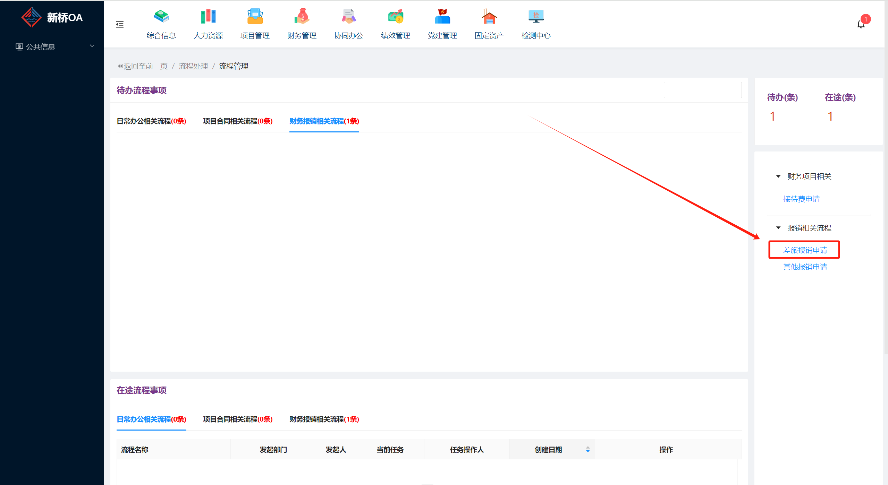
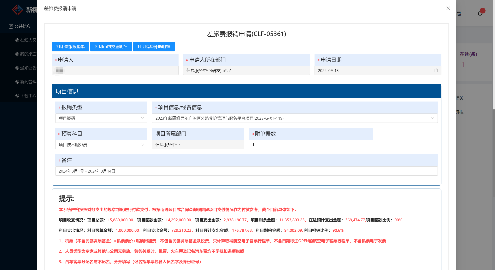
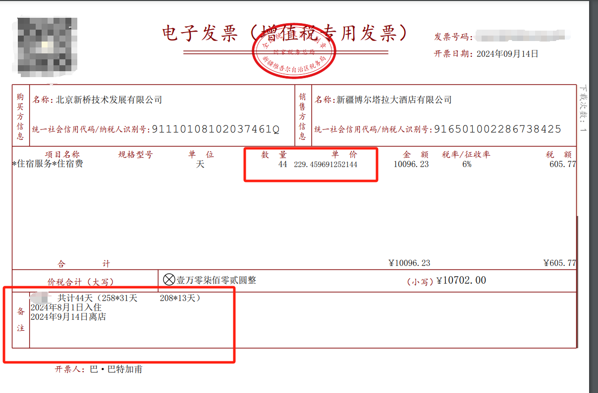
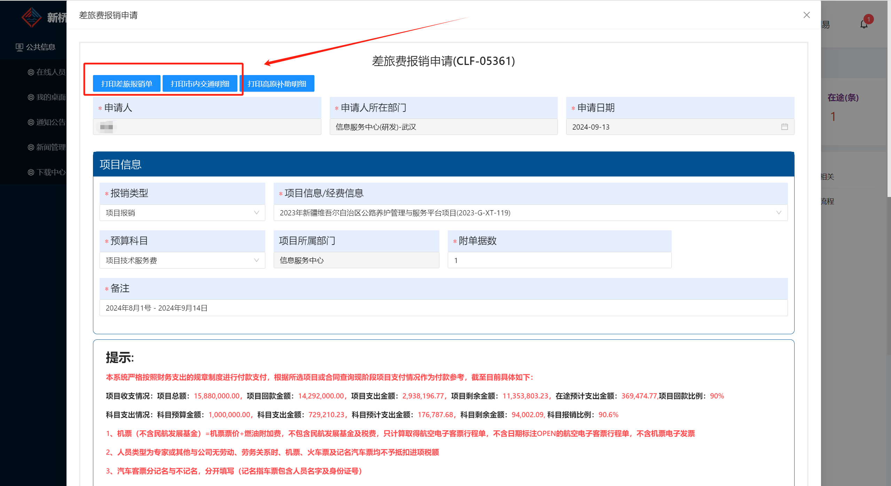

# 差旅报销流程

## OA上填写报销申请

### 1. 登录OA网站

http://www.xqoa.com.cn:8088/Start/#/Workflow/MainWorkFlow

### 2. 点击差旅报销

### 3. 参考下图填写差旅报销详情，并且阅读完提示

### 4. 机票发票

根据支付记录的金额填写机票金额

### 5. 住宿

根据住宿费的支付记录填写住宿费金额

### 6. 打车

填写打车金额

### 7.上传附件

把房费的xml格式发票压缩.zip压缩包上传到附件

## 贴票

### 1. 粘贴房费

需要贴的有：**房费纸质发票**，**支付截图**

房费发票需要**两张**

发票上需要有单日均价，还有天数，备注要写清楚，还有**支付记录截图**

还有流水单和`酒店发票专用章(如果是电子发票就不需要)`

### 2.粘贴机票行程单

飞机的行程单`纸质行程单` 或 `电子发票加上仓位图` (二选一就行)，还有**支付记录截图**

### 3.粘贴打车发票

网约车发票（需要查验，和支付记录截图）、高速费发票（不需要支付记录截图）、出租车发票（不需要支付记录截图）

### 4.粘贴差旅报销单和室内交通明细

还要打印差旅报销单和室内交通明细，差旅报销单一共有两张有一张交综合部，不贴，另外一张要贴，

### 5.粘贴顺序

1. 差旅报销单
2. 住宿费发票
3. 住宿费支付截图
4. 市内交通明细表
5. 交通发票
6. 交通支付记录截图和查验结果（纸质打车发票不用查验，电子发票需要查验）
7. 最后差旅报销单（交综合部）和住宿费发票不用粘贴
8. 在每张打印出来的纸后面签上自己的名字

### 邮寄地址

北京市北京市海淀区西土城路8号院塔四北侧二层小白楼212

## 报销注意事项

【报销提醒】请大家在粘贴“电子专票抵扣联”和“差旅报销单（交综合部）”的时候，不要用胶水贴在票后了，用曲别针别起来就好。特别是“差旅报销单（交综合部）”财务老师不进行保存会转交给综合部，不要和其他原始凭证粘在一起。

请大家打印电子发票时不要缩印的太小，会计老师会检查上面的字，如果太小了会计老师那边会看不清

【报销提醒】在之后的报销中，类似这种办公费的报销，“预算科目”填写技术服务或者前期就成
